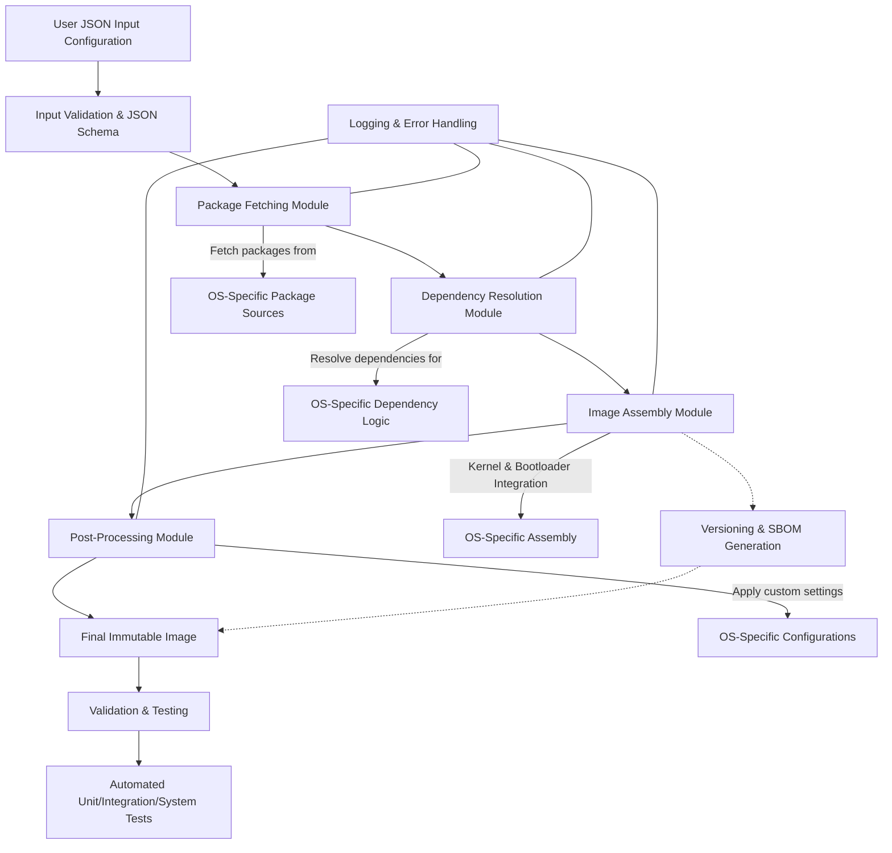

# Image Composer Architecture

## Introduction

The image composer is intended to be a generic toolkit to build operating system
images from pre-built artifacts such as `rpm`, `deb` supporting a range of
common OS for the distributed edge. You can customize the content of the OS to
suit your specific needs based on the type of application and workloads. The
image composer will first be targeting to support:

1. Edge Microvisor Toolkit (EMT) 3.0
1. AzureLinux 3.0
1. WindRiver eLxr

The image composer generates the desired image based on a JSON input which
defines what the target distribution, version, packages and kernel to include
and can generate both immutable and mutable images supporting bare metal and
VM deployments with ISO installers, raw image files and VHD (Virtual Hard
Drive).

## Architecture Overview

The following diagram outlines the high level architectural breakdown of the
image composer 

The host system should be running a validated and supported Linux distribution
such as Ubuntu 24.04. The image-composer implements all of the common business
logic which remains the same regardless of which distribution you are building
an image for. Providers exists for the supported Operating Systems with a
interface definition that each provider needs to implement to decouple
distribution specific functionality from the core and common business logic.

The image composer generates a `chroot` environment which is used for
the image composition and creation process which is isolated from the host
operating file system. Packages are fetched, with help from a provider, and
cached locally before the image is being created.

The image composer and its providers use several common `modules` across such
as logging, image creation tools for the supported output formats. Configuration
specific information for the supported distributions are held in a configuration
manifest that holds distribution specific information required to build an image.

## Operational Flow

The following flow illustrates the overall image composition flow.

